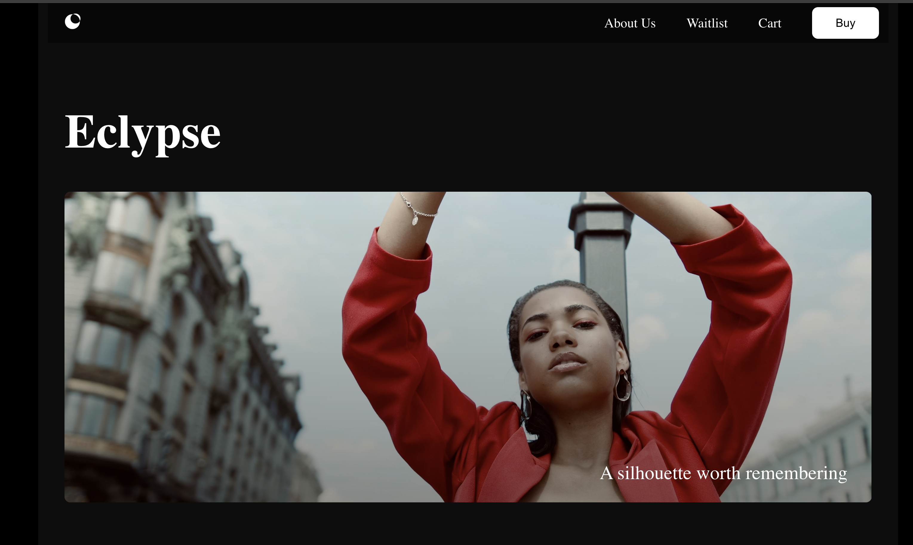
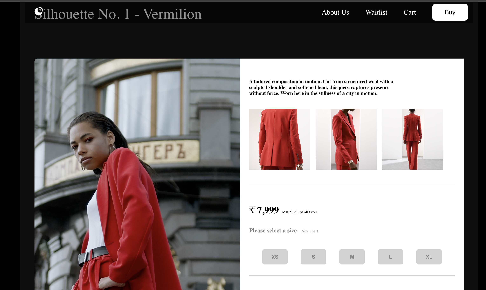
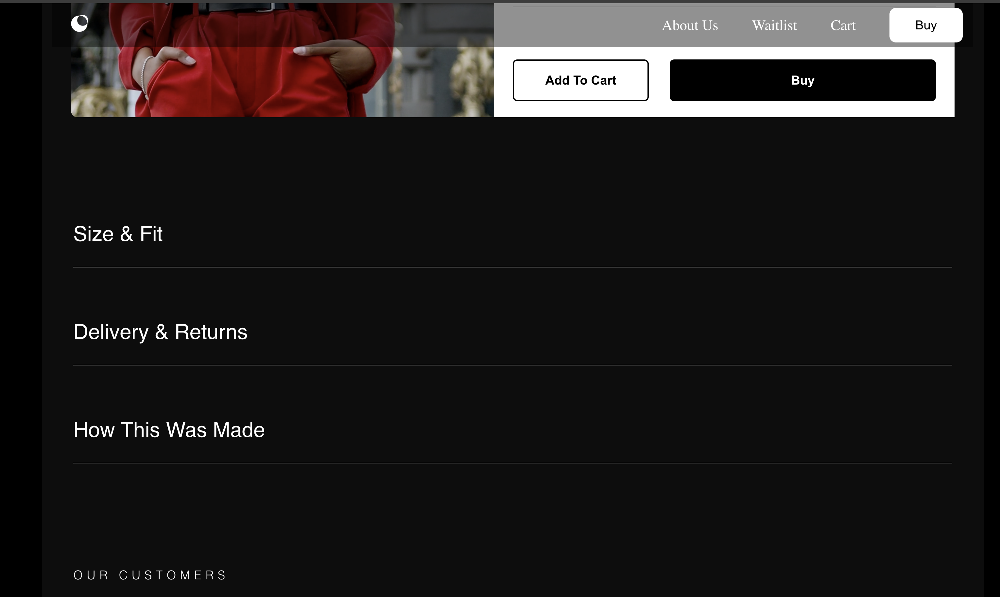

# Eclypse E-Commerce Website

[🌐 Live Demo](https://nitindevspace.github.io/Eclypse)  

The basic Structure of the project is as Follows:

Eclypse/
├── public/
│   ├── media/                     # Static media like images/videos
│   │   ├── gallery_video.mp4
│   │   └── silhouette_vid.mp4
│   └── index.html                 # Main HTML template
│
├── src/
|   ├── Backend/                   # Backend code for a dummy server
|   │   └── server.js
            
            # the frontend Home page is divided in multiple components

|   ├── Customers/                 # Customer Review section
|   │   └── Custoemrs.jsx
|   ├── Details/                   # Details section Size & Fit, etc
|   │   └── Details.jsx
|   ├── PlaceOrder/                # Check out page that sends details to the backend
|   │   └── PlaceOrder.jsx
│   ├── Gallery/                   # Gallery page/component
│   │   └── Gallery.jsx
│   ├── Hero/                      # Hero section or landing component
│   │   └── Hero.jsx
│   ├── Nav/                       # Navigation bar
│   │   └── Nav.jsx
│   ├── Silhouette/               # Silhouette section/component
│   │   └── Silhouette.jsx
│   ├── App.js                    # Main App component (with routing)
│   ├── index.js                  # React entry point
│   └── styles/                   # Optional: global or modular CSS
│       └── App.css
│
├── .gitignore
├── package.json
├── package-lock.json
├── README.md


## 📸 Screenshots

_Add screenshots of your website below:_

- 
- 
- 
- 

## 📖 Features

- Modern and modular React-based structure
- Responsive layout with reusable components
- Gallery and product details sections
- Simple backend integration for order submission
- GitHub Pages deployment with `HashRouter` for routing

## 🛠 Tech Stack

- React
- React Router DOM
- Node.js (for backend demo)
- GitHub Pages (for deployment)

## 🚀 How to Run Locally

```bash
git clone https://github.com/NitinDevSpace/Eclypse.git
cd Eclypse
npm install
npm start
```

## 🧾 License

This project is licensed under the MIT License.
